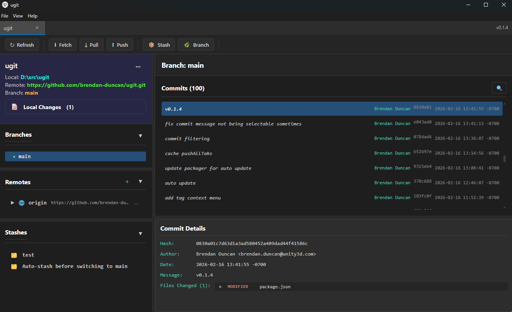

# UGit

UGit is a free, open-source Git GUI client for Windows. macOS, and Linux. It provides a visual interface for managing Git repositories, handling common Git operations like staging, committing, branching, and syncing with remotes.

### [Install](https://github.com/brendan-duncan/ugit/releases/latest)
### [Documentation](https://brendan-duncan.github.io/ugit)

----

## Building From Source

* Install [Node.js](https://nodejs.org) if you don't already have it installed.

* Install node packages by running `npm install` from the project root folder.

* Build and run for development:
  * Build the app with `npm run build`.
  * Run the app with `npm start`.

* Package into an executable:
  * `npm run build:prod`
  * `npm run build:main`
  * `npm run build:dist`
    * The output will be put into release/ and will include an installer and sub-folder with the executable.

