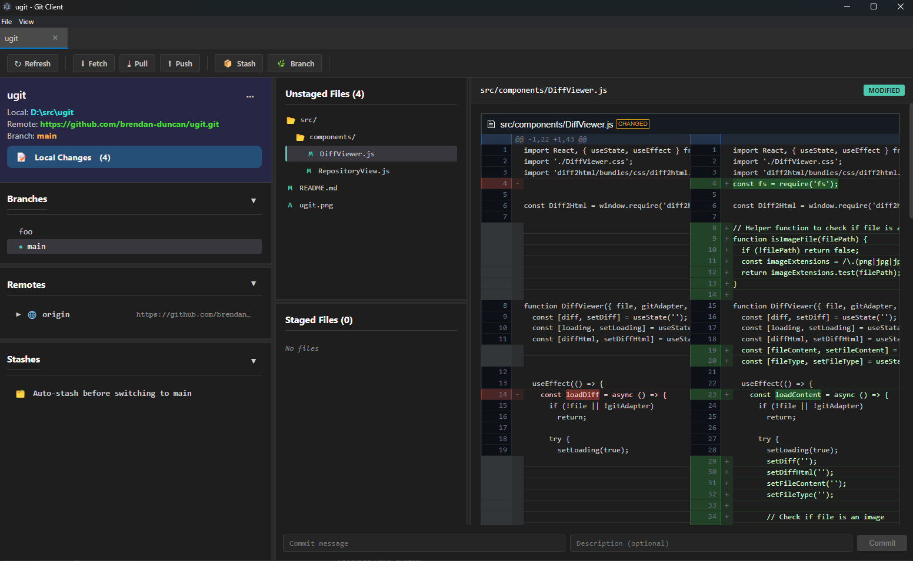

# UGit

I wanted a decent and free Git GUI and dislike the available options, so I thought I'd see how far I could get making one.

## Building

* Install [Node.js](https://nodejs.org) if you don't already have it installed.

* Install node packages by running `npm install` from the project root folder.

* Build and run for development:
  * Build the app with `npm run build`.
  * Run the app with `npm start`.

* Package into an executable:
  * npm run package
    * The output will be put into out/ugit-{os}-{arch}/

* Package into a zip for distrobution:
  * npm run make
    * The output will be put into out/make/zip/{os}/{arch}/ugit-{os}-{arch}-{version}.zip
