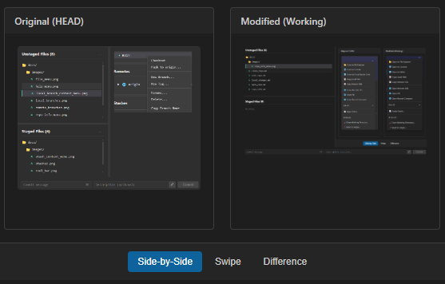
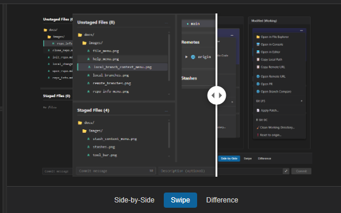
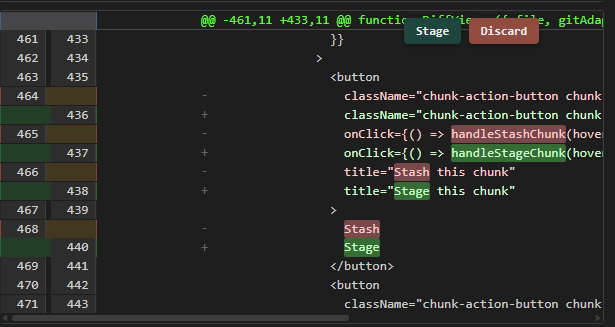
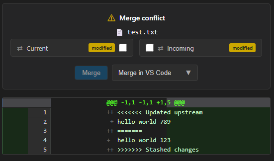

[Overview](README.md)

# DiffViewer

The DiffViewer displays changes between files, showing what was added, removed, or modified. It's shown when you select a file in the Unstaged or Staged files list.

---

## Overview

The DiffViewer shows:

| Content Type | Description |
|--------------|-------------|
| **Text files** | Syntax-highlighted diff with line-by-line or side-by-side view |
| **Image files** | Visual comparison with side-by-side, swipe, or difference modes |
| **Binary files** | Notification that diff isn't available |

---

## Text File Diffs

### View Modes

You can switch between diff view modes:

- **Line-by-Line** — Shows changes in a single column, with additions and deletions marked
- **Side-by-Side** — Shows original and modified versions next to each other

> 💡 Change the default view mode in **View → Diff View Mode**

### Understanding the Diff

| Symbol | Meaning |
|--------|---------|
| **Red line** | Content was removed |
| **Green line** | Content was added |
| **Line numbers** | Show where changes occur in the file |

### Diff Chunks

Changes are grouped into "chunks" — contiguous sections of changes. Each hunk shows:

- The range of lines affected (e.g., `@@ -10,5 +10,7 @@`)
- The actual changes within that section

---

## Image Diffs

When you select an image file (PNG, JPG, GIF, SVG, etc.), ugit provides three comparison modes.

### Side-by-Side

Shows the original and modified images next to each other.



- **Left panel** — Original (HEAD version)
- **Right panel** — Modified (working directory)

### Swipe

A single view with a draggable divider:



- **Left of bar** — Original image
- **Right of bar** — Modified image
- **Drag** the handle left or right to compare different areas

### Difference

Shows a computed difference image:


- **Black pixels** — No change
- **Colored pixels** — Areas that differ
- The more different the pixel, the brighter it appears

This helps identify exactly what changed in an image.

---

## Chunk Actions

When you hover over a diff chunk, action buttons appear:



| Action | Description |
|--------|-------------|
| **Stage** | Stage only this chunk |
| **Discard** | Discard changes in this chunk |

> ⚠️ **Warning:** Discarding changes cannot be undone.

---

## Conflict Resolution

When viewing a conflicted file during a merge, the DiffViewer shows conflict markers:

```
<<<<<<< HEAD
Your changes
=======
Incoming changes
>>>>>>> branch-name
```

Use the conflict resolution controls to choose which version to keep:



1. Select ** Ours** or **Theirs** 
2. Click **Merge** to resolve with that version
3. Or click **Merge in VS Code** to open in your editor

---

## Keyboard Shortcuts

| Action | Shortcut |
|--------|----------|
| Refresh diff | `F5` |

---

## Tips

### Review Before Committing

Always review your changes in the DiffViewer before staging and committing. This ensures you're including exactly what you intend.

### Check Image Changes

For images, use the **Difference** mode to spot subtle changes that might be hard to see otherwise.

### Use Chunk Staging

For large files, you can stage or discard individual chunks rather than the entire file.

---

## Troubleshooting

### "No changes to display"

This can happen when:
- The file hasn't been modified
- The file is binary and Git can't compute a diff
- The file was deleted

### Image Not Loading

- Check that the file exists in the working directory
- Verify you have permission to read the file

### Diff Shows Wrong Content

If you expect to see changes but don't:
1. Click on the file in the file list to refresh
2. Check if the file was accidentally staged
3. Try switching between view modes

---

## Related

- [Local Changes](local_changes.md) — Managing staged and unstaged files
- [Branches](local_branches.md) — Working with local branches
- [Merging](local_branches.md#merging-branches) — Merging branches
