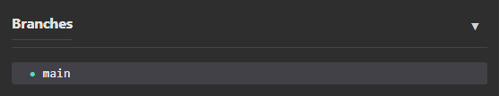

# Branches

The Branches panel displays all local branches in your repository. You can view commit history, switch branches, create new branches, and manage existing branches.

---

## Viewing Branches

### Local Branches

Local branches are shown in a tree structure:
- Current branch is marked with a filled circle (●)
- Branch status shows ahead (↑) and behind (↓) counts relative to remote
- Double-click a branch to switch to it

---

## Switching Branches

### Method 1: Double-Click

Double-click any branch to check it out and make it your current branch.

### Method 2: Context Menu

1. Right-click on a branch
2. Select **Checkout**

> ℹ️ Uncommitted changes may prevent switching. Commit, stash, or discard changes first.

---

## Creating Branches

### From Current Branch

1. Right-click in the Branches panel
2. Select **New Branch...**
3. Enter a branch name
4. Optionally check **Checkout after create** to switch to the new branch
5. Click **Create**

### From a Specific Commit

1. Right-click on a commit in the commit list
2. Select **New Branch from Commit**
3. Enter a branch name
4. Click **Create**

---

## Branch Context Menu

Right-click on any branch for additional options:

| Action | Description |
|--------|-------------|
| **Checkout** | Switch to this branch |
| **Pull** | Pull latest changes from remote |
| **Push to Origin** | Push this branch to remote |
| **Merge into Active** | Merge this branch into current branch |
| **Rebase Active onto Branch** | Rebase current branch onto this branch |
| **New Branch** | Create new branch from this branch |
| **New Tag** | Create tag at this branch's position |
| **Rename** | Rename this branch |
| **Delete** | Delete this branch |
| **Copy Branch Name** | Copy branch name to clipboard |

---

## Deleting Branches

1. Right-click on the branch
2. Select **Delete**
3. Confirm the deletion

> ⚠️ You cannot delete your current branch. Switch to another branch first.

---

## Merging Branches

### Merge Another Branch into Current

1. Right-click on the branch you want to merge
2. Select **Merge into Active**
3. Resolve any conflicts if necessary
4. Commit the merge

### Rebase Current Branch

1. Right-click on the branch you want to rebase onto
2. Select **Rebase Active onto Branch**

> ⚠️ **Warning:** Rebasing rewrites commit history. Avoid on shared/public branches.

---

## Branch Naming

### Best Practices

- Use descriptive names (e.g., `feature/login-page`, `bugfix/header-issue`)
- Use slashes for grouping (e.g., `feature/`, `bugfix/`, `hotfix/`)
- Avoid special characters and spaces
- Keep names lowercase with hyphens or underscores

### Common Patterns

| Pattern | Example |
|---------|---------|
| Feature | `feature/user-auth` |
| Bugfix | `bugfix/login-error` |
| Hotfix | `hotfix/security-patch` |
| Release | `release/v1.0.0` |
| Experiment | `experiment/new-ui` |

---

## Tips

### Work on Features

1. Create a new branch for each feature or bugfix
2. Make commits on your feature branch
3. Merge or rebase when complete

### Keep Main Clean

- Keep your `main` branch clean
- Don't commit directly to main
- Use feature branches for all changes

### Sync Regularly

- Pull from remote frequently
- Keep your local branches up-to-date

---

## Related

- [Local Changes](local_changes.md) — Managing uncommitted changes
- [Commits](commits.md) — Working with commit history
- [Remotes](remotes.md) — Managing remote repositories
- [Stashes](stashes.md) — Saving and applying stashed changes
