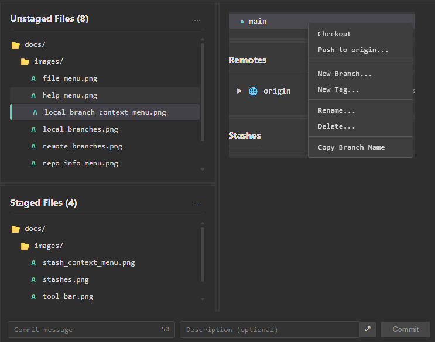

[Overview](README.md)

# Local Changes Panel

The Local Changes panel is where you view, stage, and commit changes in your working directory. It's one of the main panels in ugit for managing your uncommitted work.

---

## Overview

The panel is split into two sections:

| Section | Description |
|---------|-------------|
| **Unstaged Files** | Files you've modified but haven't prepared for commit |
| **Staged Files** | Files ready to be committed |

Below these sections is a commit form where you can enter a commit message and create a commit.

---

## File Lists

### Unstaged Files

This section shows files that have been modified but not yet staged. These changes exist only in your working directory.

**Status indicators:**
- `M` — Modified
- `D` — Deleted
- `C` - Conflicted
- `A` — Added (new file)

### Staged Files

This section shows files that have been staged and are ready to be committed. These changes will be included in your next commit.

---

## Staging Files

### Stage Individual Files

1. Click the **+** button next to a file in the Unstaged Files list
2. The file moves to the Staged Files list

### Stage All Files

Click **Stage All** to move all unstaged files to the staged list.

### Unstage Files

1. Click the **−** button next to a file in the Staged Files list
2. The file moves back to Unstaged Files

---

## Drag and Drop

You can drag and drop files between the Unstaged and Staged lists:

- **Drag from Unstaged to Staged** — Stage the file
- **Drag from Staged to Unstaged** — Unstage the file

You can also drag multiple files at once.

---

## Viewing Changes

Click on any file in either list to view its changes in the **Diff Viewer** on the right.

The diff viewer shows:
- **Red lines** — Removed content
- **Green lines** — Added content

---

## Committing Changes

### 1. Stage Your Files

Move the files you want to commit to the Staged list.

### 2. Enter Commit Message

Type a descriptive message in the commit input field.

> ℹ️ For longer descriptions, click the **description** toggle to expand a larger text area.

### 3. Commit

Click **Commit** to create the commit with your staged changes.

---

## Commit Without Pulling

If your branch is behind the remote, ugit will prompt you:

- **Pull & Commit** — Pull remote changes first, then commit
- **Commit Only** — Commit without pulling (may cause conflicts)

## Branch Commit Block List

In Preferences you can define a list of branch names to prevent commits for. This is used to prevent committing to a branch that requires a separate Pull Request branch.

---

## Discarding Changes

### Discard Individual File

Right-click on an unstaged file and select **Discard Changes**.

### Discard All Unstaged Changes

Click **Discard All** to remove all unstaged changes.

> ⚠️ **Warning:** This permanently deletes your changes. This action cannot be undone.

---

## Context Menu Actions

Right-click on any file for additional options:

| Action | Description |
|--------|-------------|
| **Discard** | Remove changes to this file |
| **Stage** | Move file to staged list |
| **Unstage** | Move file back to unstaged |
| **Open in Editor** | Open the file in your code editor |
| **Open in Explorer** | Show file in file explorer |

---

## Keyboard Shortcuts

| Action | Shortcut |
|--------|----------|
| Stage selected | `Ctrl+S` |
| Unstage selected | `Ctrl+U` |
| Commit | `Ctrl+Enter` |

---

## Tips

### Commit Often

Make small, frequent commits with clear messages. This makes it easier to track changes and revert if needed.

### Review Before Committing

Always review your changes in the Diff Viewer before committing to ensure you're including exactly what you intend.

### Write Good Commit Messages

- First line: Short summary (under 50 characters)
- Optional description: Explain *what* and *why*, not *how*

---

## Related

- [DiffViewer](diff_viewer.md) — Viewing file changes
- [Commits](commits.md) — Working with commit history
- [Branches](local_branches.md) — Managing local branches
