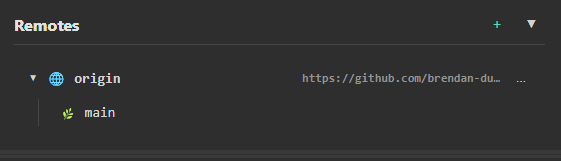

[Overview](README.md)

# Remotes

The Remotes panel displays remote repositories connected to your local repository. Remotes are used to synchronize your work with other repositories, typically on services like GitHub, GitLab, or Bitbucket.



---

## Overview

The Remotes panel shows:

| Section | Description |
|---------|-------------|
| **Remote Name** | The name of the remote (e.g., `origin`) |
| **Remote URL** | The web address of the remote repository |
| **Remote Branches** | Branches available on the remote |

---

## Common Remote Names

| Name | Typical Use |
|------|-------------|
| `origin` | Your main remote (where you cloned from) |
| `upstream` | The original repository (for forks) |

---

## Viewing Remotes

### Expand a Remote

Click on a remote to expand and view its branches.

The panel shows:
- **Remote icon** (🌐) with remote name
- **URL** of the remote repository
- **Branches** available on that remote (e.g., `origin/main`, `origin/develop`)

### Collapse a Remote

Click the remote again or use the collapse button to hide its branches.

---

## Adding a Remote

### Method 1: From RepoInfo Panel

1. Right-click on the RepoInfo panel
2. Select **Edit Remote URL**
3. Enter the remote URL
4. Click **Save**

### Method 2: From Remotes Panel

1. Click the **+** button in the Remotes panel header
2. Enter a name (e.g., `origin`, `upstream`)
3. Enter the remote URL
4. Click **Add Remote**

---

## Remote URL Formats

### HTTPS

```
https://github.com/username/repository.git
https://gitlab.com/username/repository.git
```

### SSH

```
git@github.com:username/repository.git
git@gitlab.com:username/repository.git
```

> ℹ️ ugit automatically converts SSH URLs to HTTPS when opening in a browser.

---

## Remote Actions

Right-click on a remote for additional options:

| Action | Description |
|--------|-------------|
| **Open in Browser** | Open the remote repository in your web browser |
| **Copy URL** | Copy the remote URL to clipboard |
| **Edit** | Change the remote URL |
| **Delete** | Remove this remote |

---

## Remote Branch Actions

Right-click on a remote branch for options:

| Action | Description |
|--------|-------------|
| **Checkout** | Create a local branch tracking this remote branch |
| **Pull** | Pull changes from this remote branch into current branch |
| **Merge** | Merge this remote branch into current branch |
| **New Branch** | Create a new branch based on this remote branch |
| **New Tag** | Create a tag at this remote branch |
| **Delete** | Delete this remote branch |
| **Copy Name** | Copy branch name to clipboard |

---

## Fetching and Pulling

### Fetch

Fetching downloads commits and branches from the remote without merging them into your local branches.

- Right-click on a remote → **Fetch**
- Or use the **Fetch** button in the toolbar

### Pull

Pulling fetches and merges changes from a remote branch into your current branch.

- Right-click on a remote branch → **Pull**
- Or use the **Pull** button in the toolbar

---

## Pushing

### Push to Remote

1. Make sure you have commits to push
2. Click **Push** in the toolbar
3. Or right-click on a branch → **Push to Origin**

### Push a New Branch

When you push a new branch for the first time:

1. Right-click on your local branch
2. Select **Push to Origin**
3. The branch will be created on the remote

---

## Managing Multiple Remotes

### Adding Upstream for Forks

If you forked a repository:

1. Click **+** in Remotes panel
2. Name: `upstream`
3. URL: The original repository URL (not your fork)
4. Click **Add Remote**

This lets you fetch changes from the original repository.

### Syncing with Upstream

1. Fetch from upstream: `git fetch upstream`
2. Merge or rebase onto your branch

---

## Troubleshooting

### Remote Not Found

- Check the remote URL is correct
- Verify you have network connectivity
- Ensure you have permission to access the remote

### Authentication Failed

- For HTTPS: Use a personal access token as your password
- For SSH: Ensure your SSH keys are configured and added to your Git hosting account

### Push Rejected

The remote has changes that you don't have locally. Pull first, then push:

1. Pull from remote: `git pull origin branch-name`
2. Resolve any conflicts
3. Push again: `git push origin branch-name`

---

## Tips

### Keep Your Remotes Clean

- Remove remotes you no longer use
- Use meaningful names (`origin` for your fork, `upstream` for original)

### Pull Regularly

- Pull frequently to stay up-to-date
- Pull before pushing to avoid conflicts

### Use HTTPS for Quick Setup

- HTTPS doesn't require SSH key configuration
- Use a personal access token for authentication

---

## Related

- [Branches](local_branches.md) — Managing local branches
- [Local Changes](local_changes.md) — Managing uncommitted changes
- [Cloning a Repository](clone_repo.md) — Cloning from a remote
