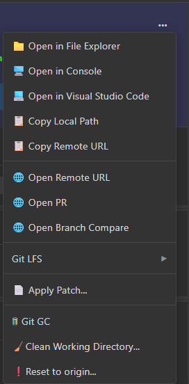

# RepoInfo Panel

The RepoInfo panel displays key information about your repository at a glance. It's located at the top of the repository view.

---

## What's Displayed

The panel shows:

| Field | Description |
|-------|-------------|
| **Local** | The full path to your repository on your computer |
| **Remote** | The URL of the remote repository (e.g., `origin`) |
| **Branch** | The currently checked-out branch |
| **Local Changes** | Click to view unstaged and staged files |

---

## Local Changes Section

The **Local Changes** section shows:
- **Count** — Number of modified files
- **Click** — Opens the Local Changes panel to stage, unstage, or commit files
- **Cache indicator** — Shows when using cached data

---

## Menu

The Repo Info menu is accessed via the "..." label on the upper-right of the panel.

### Repository Actions

| Action | Description |
|--------|-------------|
| **Open in Explorer** | Open the repository folder in your file explorer |
| **Open in Console** | Open a terminal/command prompt in the repository folder |
| **Open in Editor** | Open the repository in your default code editor |

### Remote Actions

| Action | Description |
|--------|-------------|
| **Edit Remote URL** | Change the remote (origin) URL |
| **Copy Remote URL** | Copy the remote URL to clipboard |
| **Open on Remote** | Open the repository page in your browser |
| **Open Pull Request** | Open the PR creation page (if supported) |
| **Open Compare** | Open the comparison view on the remote |

### Stash Actions

| Action | Description |
|--------|-------------|
| **Stash Changes** | Temporarily save uncommitted changes |
| **Stash Pop** | Apply the most recent stash |
| **Stash Drop** | Delete the most recent stash |

### Git LFS Actions

| Action | Description |
|--------|-------------|
| **Add Track Pattern** | Track files matching a pattern with Git LFS |
| **Status** | View Git LFS file status |
| **Fetch** | Fetch LFS objects from remote |
| **Pull** | Pull LFS objects from remote |
| **Prune** | Remove old LFS objects |
| **Deinitialize** | Remove Git LFS from this repository |

### Maintenance Actions

| Action | Description |
|--------|-------------|
| **Apply Patch** | Apply a `.patch` file to your repository |
| **Git GC** | Run garbage collection to optimize repository |
| **Clean Working Directory** | Remove untracked files |
| **Reset to Origin** | Discard all changes and reset to remote |

---

## Quick Actions

### Copy Repository Path

Right-click → **Copy Local Path** to copy the repository folder path to your clipboard.

### Open in Browser

If you have a remote configured (like GitHub or GitLab), you can:
- **Open on Remote** — View the current branch on the website
- **Open Compare** — Compare branches
- **Open Pull Request** — Create a new PR (GitHub/GitLab)

---

## Example Workflows

### Viewing Local Changes

1. Look at the **Local Changes** count in the RepoInfo panel
2. Click on it to open the Local Changes panel
3. Stage or unstage files as needed

### Syncing with Remote

1. Right-click on RepoInfo panel
2. Select **Open in Console**
3. Run `git pull` to sync changes

### Managing Remote URL

1. Right-click on RepoInfo panel
2. Select **Edit Remote URL**
3. Enter the new URL

---

## Related

- [Local Changes Panel](local_changes.md) — Stage, unstage, and commit files
- [Branches](local_branches.md) — Managing local branches
- [Remotes](remotes.md) — Working with remote repositories
