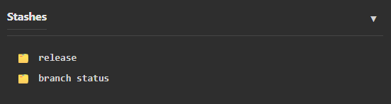

[Overview](README.md)

# Stashes

Stashes are a way to save your uncommitted changes temporarily without committing them. This is useful when you need to switch branches but have uncommitted work, or when you want to set aside changes temporarily.



---

## What is a Stash?

A stash takes your uncommitted changes (both staged and unstaged) and saves them as a temporary commit. Your working directory is then cleaned, allowing you to:

- Switch branches without committing
- Pull changes that might conflict
- Work on something else temporarily
- Come back to your changes later

---

## Creating a Stash

### From Local Changes Panel

1. Right-click on the **Local Changes** section in the RepoInfo panel
2. Select **Stash Changes**
3. Enter an optional stash message
4. Click **Stash**

### Using Keyboard Shortcut

1. Make sure you have uncommitted changes
2. Right-click → **Stash Changes**

### Auto-Stash

ugit automatically creates a stash in certain situations:

- When pulling changes with uncommitted work
- When switching branches with uncommitted work

---

## Viewing Stashes

The Stashes panel shows all saved stashes:

| Field | Description |
|-------|-------------|
| **Icon** | Stash indicator (🗂️) |
| **Message** | Your stash description |
| **Index** | Stash number (stash@{0} is most recent) |

Click on a stash to view its details.

---

## Applying a Stash

### Apply (Keep Stash)

Applying a stash brings back the saved changes but keeps the stash in the list.

1. Right-click on a stash
2. Select **Apply**
3. Resolve any conflicts if necessary

### Pop (Apply and Remove)

Popping applies the most recent stash and removes it from the stash list.

This is the same as:
1. Apply the stash
2. Delete the stash

---

## Deleting a Stash

### Delete a Specific Stash

1. Right-click on a stash
2. Select **Delete**

### Clear All Stashes

> ⚠️ This permanently deletes all stashes.

Stashes can only be deleted one at a time through the UI.

---

## Renaming a Stash

1. Right-click on a stash
2. Select **Rename**
3. Enter a new message
4. Click **Rename**

---

## Stash Workflows

### Workflow 1: Switch Branches with Uncommitted Work

1. You have uncommitted changes on `feature-branch`
2. You need to check `main` quickly
3. Right-click → **Stash Changes**
4. Switch to `main`
5. Do your work
6. Switch back to `feature-branch`
7. Right-click on stash → **Apply** or **Pop**

### Workflow 2: Pull with Uncommitted Changes

1. You have uncommitted changes
2. You click **Pull**
3. ugit detects uncommitted work and offers to stash first
4. Accept the auto-stash
5. Pull completes
6. Your stash is automatically applied
7. Resolve any conflicts if necessary

### Workflow 3: Save Work in Progress

1. You have incomplete changes
2. You want to try something different
3. Stash your current work with a message like "WIP: feature X"
4. Try your experiment
5. When done, pop the stash to continue

---

## Stash Commands Reference

| Git Command | Description |
|-------------|-------------|
| `git stash` | Save uncommitted changes |
| `git stash push -m "message"` | Stash with a message |
| `git stash list` | List all stashes |
| `git stash pop` | Apply most recent stash and remove it |
| `git stash apply` | Apply stash without removing |
| `git stash drop` | Delete a specific stash |
| `git stash clear` | Delete all stashes |

---

## Tips

### Use Descriptive Messages

When creating a stash, use a clear message:

- "WIP: login feature" — Work in progress
- "Before refactor" — Saving state before big change
- "Hotfix ready to commit" — Changes ready for another branch

### Don't Rely on Stashes Long-Term

Stashes are meant for temporary storage. Commit your changes when you're ready.

### Stashes vs Branches

- **Branches**: For long-term feature development
- **Stashes**: For temporary storage (minutes to hours)

---

## Troubleshooting

### Stash Conflicts

When applying a stash, you may get merge conflicts. Resolve them like regular merge conflicts, then continue.

### Stash Not Applying

If a stash won't apply cleanly:

1. Try `git stash drop` to remove it
2. Manually recreate the changes
3. Or commit your work instead

### Lost Stashes

If you accidentally drop a stash, you may be able to recover it with:

```
git fsck --unreachable | grep commit
```

---

## Related

- [Local Changes](local_changes.md) — Managing uncommitted changes
- [Branches](local_branches.md) — Managing local branches
- [Merging](local_branches.md#merging-branches) — Merging branches
