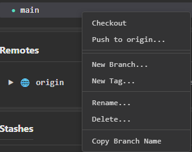

# ugit — Branch Commit Context Menu Reference

Right-clicking a commit in the **Commits** list on any branch opens a context menu with actions scoped to that specific commit.

---

## Branching & Tagging

### New Branch...
Create a new branch starting from the selected commit. Opens a dialog to name the new branch.

### New Tag...
Create a new Git tag pointing to the selected commit. Useful for marking releases or milestones.

---

## Branch Manipulation

### Rebase 'main' to Here
Rebase the current branch (`main`) so that it replays commits on top of the selected commit. This rewrites branch history.

> ⚠️ **Warning:** Rebasing rewrites commit history. Avoid on shared/public branches.

### Reset 'main' to Here
Move the `main` branch pointer to the selected commit. Depending on the reset mode (soft, mixed, or hard), working tree and index state may be affected.

> ⚠️ **Warning:** A hard reset will discard uncommitted changes permanently.

---

## Commit Editing

### Amend Commit...
Modify the most recent commit's message or content. Opens a dialog to make changes before re-committing.

> ℹ️ Only applicable when the selected commit is the latest (`HEAD`) commit.

### Checkout Commit...
Detach `HEAD` and check out the selected commit directly. Places the repository in a **detached HEAD** state for inspection or experimentation.

### Cherry-pick Commit...
Apply the changes introduced by the selected commit onto the currently active branch. Useful for porting specific fixes or features across branches.

### Revert Commit...
Create a new commit that undoes the changes introduced by the selected commit. Unlike reset, this is a non-destructive operation safe for shared branches.

### Save as Patch...
Export the selected commit's changes as a `.patch` file. Useful for sharing changes without pushing to a remote.

---

## Clipboard Actions

### Copy Commit SHA
Copy the full SHA hash of the selected commit to the clipboard.

**Example output:** `a1b2c3d4e5f67890abcd1234ef567890abcd1234`

### Copy Commit Info
Copy a summary of the commit (typically SHA, author, date, and message) to the clipboard. Useful for referencing in issue trackers or documentation.

---

## Action Summary

| Action                  | Category             | Destructive? |
|-------------------------|----------------------|--------------|
| New Branch...           | Branching & Tagging  | No           |
| New Tag...              | Branching & Tagging  | No           |
| Rebase 'main' to Here   | Branch Manipulation  | ⚠️ Yes       |
| Reset 'main' to Here    | Branch Manipulation  | ⚠️ Yes       |
| Amend Commit...         | Commit Editing       | ⚠️ Yes       |
| Checkout Commit...      | Commit Editing       | No           |
| Cherry-pick Commit...   | Commit Editing       | No           |
| Revert Commit...        | Commit Editing       | No           |
| Save as Patch...        | Commit Editing       | No           |
| Copy Commit SHA         | Clipboard            | No           |
| Copy Commit Info        | Clipboard            | No           |
