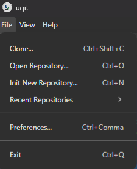

[Overview](README.md)

# ugit — File Menu Reference

The **File** menu provides core repository management actions. It can be accessed from the menu bar or via keyboard shortcuts.

---

## Menu Items

### Clone...
`Ctrl+Shift+C`

Clone a remote repository to your local machine. Opens a dialog to specify the source URL and destination directory.

---

### Open Repository...
`Ctrl+O`

Open an existing local repository. Launches a file browser to navigate to and select a repository folder.

---

### Init New Repository...
`Ctrl+N`

Initialize a brand-new Git repository. Prompts you to choose a directory where the `.git` folder will be created.

---

### Recent Repositories `›`

Displays a submenu listing recently opened repositories for quick access. No keyboard shortcut — navigate with your mouse or arrow keys.

---

### Preferences...
`Ctrl+,`

Open the application settings panel to configure ugit's appearance, behavior, and defaults.

---

### Exit
`Ctrl+Q`

Quit the ugit application.

---

## Keyboard Shortcut Summary

| Action                  | Shortcut        |
|-------------------------|-----------------|
| Clone...                | `Ctrl+Shift+C`  |
| Open Repository...      | `Ctrl+O`        |
| Init New Repository...  | `Ctrl+N`        |
| Preferences...          | `Ctrl+,`        |
| Exit                    | `Ctrl+Q`        |
